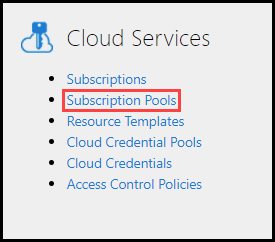
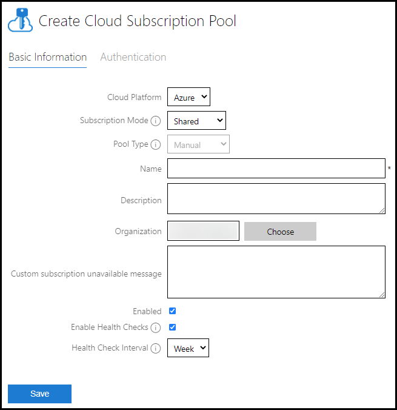
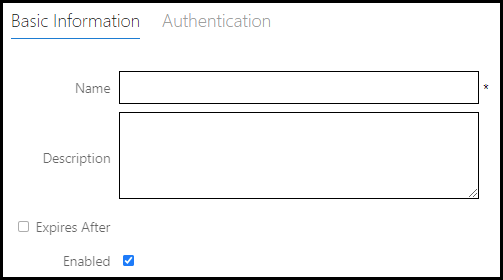
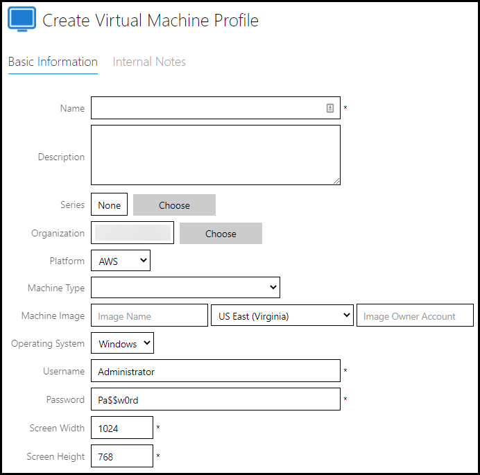

# Amazon Web Services Virtualization 

- [Organization Account creation](#organization-account-creation)
- [IAM User Creation](#iam-user-creation)
- [Skillable Studio Subscription Pool Setup](#skillable-studio-subscription-pool-setup)
- [Skillable Studio Subscription Setup in Subscription Pool](#skillable-studio-subscription-setup-in-subscription-pool)
- [Virtual Machine Prep](#virtual-machine-prep)
- [Upload VHD to AWS and Create AMI](#upload-vhd-to-aws-and-create-ami)
- [VM Profile Creation](#vm-profile-creation)

## Organization Account creation

An account must be created in your organization. This account will be used to launch an AWS VM when a user launches a lab. 

1. Log in to the [AWS Management Console](https://aws.amazon.com/console/) with your root account credentials.
2. Go to **My Organization** from the menu in the upper-right corner of the page.
3. Click **Add Account**.

	{500}
	
1. If you already have an organization account, click **Invite Account**.
	1. Enter the email or Account ID of the organization account. 
	1. Click **Invite**. 
1. If you need to create an Account, click **Create account**.

	{500}
	
	1. Enter an AWS account name. 
	1. Enter an email address for the account, that belongs to the catch all domain. This is the email address that will be used to contact you about this account. 
	1. Enter an IAM role name for this account. AWS Organizations create this role to grant the organization full administrative control over the new account.
5. Log out of the AWS portal and log in to the account that was just created, using the email address used during account creation.
6. Click **Forgot Password**. The password for the account will be sent to the Organizations Master account. The Master account is the account that was used to created the AWS Organization initially. 
	>[!alert] You may need to contact the administrator that created the AWS organization for assistance with the password reset email.
7. Once you receive the password, log in to the AWS Portal. 

Next an IAM user needs to be created. 

## IAM User Creation 

1. Click the **AWS icon** in the upper-left corner to return home. 

1. Under **Find Services**, search for **IAM**. 

    

1. Click **IAM**.

1. Click **User** on the left side of the page. 

1. Click **Add User**. 

1. Enter a name for the user. I.E. _SkillableStudioAPI_. The naming doesn't really matter, as long as the lab author will recognize it later. 

1. Next, select **programmatic  Access**. This enables an access key ID and secret access key for the AWS API, CLI, SDK, and other development tools. 

    
    
1. Click **Next: permissions**. 

1. Under Set Permissions, select **Attach existing policies directly**. 

1. In the _Filter Policies_ field, search for ***Org***.

1. Click the checkbox to select the policy name ***AWSOrganizationsFullAccess***. AWSOrganizationsFullAccess being assigned is required, so that the Skillable Studio  service account can manage the organization. 

    

1. In the _Filter Policies_ field, search for **Admin**

1. Click the checkbox to select **AdministratorAccess**. This will allow the Skillable Studio  service account full access to manage the root AWS Account.

    

1. Click Next: tags.

1. Click Next: review.

1. Click **Create user**. 

>[!alert] Record your access key ID and secret access key in a secure location. Once this page is closed, you will not be able to obtain this information again. These will be used in later steps, when configuring the Cloud Subscription in the Subscription Pool.  

## Skillable Studio  Subscription Pool Setup

1. From the Skillable Studio  Admin page, click **Subscription Pools** on the Cloud Services tile.

	{400}
	
1. Click **Create Cloud Subscription Pool** in the upper-right corner.

{600}

1. Select **AWS** from the Cloud Platform drop-down menu. 
1. Select **Shared** from the Subscription Mode drop-down menu. 
1. Select **Manual** from the Pool type drop-down menu.
1. Enter a **Name** for the pool.
1. Enter a **Description** for the pool. 
1. Select the **Organization** that the pool will be owned by. 
1. **(Optional)** Enter a **custom subscription unavailable message**. This message will display to lab users if the subscription is unavailable. 
1. Check the box to enable the subscription pool for use. 
1. Enable or disable **Health Checks**. This enables health checks across all subscriptions in this pool. Skillable Studio  will periodically check the subscription for configuration errors and other potential problems. 
1. If Health Checks are enabled, select the frequency that the health check will occur. The health check for each subscription will be completed at the specified interval. 

## Skillable Studio  Subscription Setup in Subscription Pool

1. Navigate to the Subscription Pool that was created in previous steps. 
1. Click **Create Cloud Subscription**.
2. On the **Basic Information tab**, configure the following:

	{400}
	
	1. Enter a **Name** for the subscription
	1. Enter a **Description** for the subscription. 
	1. (Optional) Enter an expiration date and time. The subscription will not be available to use once the expiration date and time occurs.
	1. Check the box to enable the subscription for use.
3. On the **Authentication tab**, configure the following:

	{400}
	
	1. Check the box to **Override Pool Authentication**. Selecting this will use the authentication information on the subscription instead of the authentication information on the subscription pool.
	1. Enter the Catch All Domain that was used during organization account creation. 
	1. Enter the Access Key ID that was generated during IAM user account creation. 
	1. Enter the Access key Secret that was generated during IAM user account creation. 
	
## Virtual Machine Prep

You must export your virtual machine to a VHD and upload to AWS to create an Amazon Machine Image (AMI). 

The virtual machine needs to be prepared: 

1. Launch your virtual machine. 

1. On your Virtual machine, there are 2 settings that need to be configured before exporting to a VHD.
	- Enable DHCP
	- Enable RDP 

1. Capture a final differencing disk of the virtual machine. 

1. Export VM to VHD format. 

## Upload VHD to AWS and Create AMI

1. If the exported VM resulted in multiple VHDs, merge the disk chain into a single VHD. 

1. Using the log in credentials created in [previous steps](#organization-account-creation), then log in to the AWS portal. 

1. In the AWS portal, create an S3 bucket. 

1. On your local machine, [install AWS CLI](https://docs.aws.amazon.com/cli/latest/userguide/cli-chap-install.html). If you already have AWS CLI installed, ensure it is up to date. 

1. Create a JSON file with specific information for image import into AWS.

1. Reference the JSON file and run the import command using [this AWS documentation](https://docs.aws.amazon.com/vm-import/latest/userguide/vmimport-image-import.html).

1. Note the **job number** that is associated with the command. You must wait until it is noted as **Complete before continuing to the next steps**. 

1. After the job is completed, go to the [AWS Management Console](https://aws.amazon.com/console/) and log in to the account where the AMI was created. 

1. Go to the **EC2** page in the AWS Management Console. 

1. On the left side of the page, click **AMIs** under the Images section. 

1. Select the new AMI that you created. 

1. Right-click AMI and select **Launch**. 

1. Select the **Instance** type and **size** for the machine.

1. Click **Review and Launch**.

1. Allow the VM to start, then **connect via RDP**. 

	>[!knowledge] The VM may take a few minutes for resource usage to stabilize. 

1. **Exit the RDP window**, but leave the VM running. 

1. Go back to the **EC2** page in the AWS Management Console, and click **Instances** on the left-side of the page under the Instances section. 

1. **Select the Instance** for the AMI that you launched. 

1. **Right-click** the Instance and select **Capture new AMI image**. 

1. After the image finishes capturing, go back to the AMIs section and **click AMIs**. 

1. **Select the new AMI image** that was just created after capturing an AMI image. 

1. Change the name of the AMI to a more friendly name, be specific. 

1. The AMI needs to be shared with all accounts that will be used to launch the VM. 

	1. Select the AMI. 

	1. Click the **Permissions** tab near the bottom of the page. 

	1. Click **Edit**. 

	1. Enter any account numbers that should be given permission to launch the AMI, and then click **Add Permission**. Account numbers can only be entered one at a time. 

	1. After all account numbers are added, click **Save**. 

The AMi can now be configured in a Skillable Studio  lab profile. 

## VM Profile Creation

1. Go to [Skillable Studio ](https://labondemand.com). 

1. From the Admin page, click **Create Virtual Machine Profile** from the Virtual Machines tile. 

	{400}
	
1. Complete the following fields on the VM profile: 
 
	{600}
	
	- Name: use the same friendly name that was used for the AMI in the AWS management console. 
	- Description: describe the intended use of the VM.
	- Series: Select the lab series that the lab profile will be associated with.
	- Organization: Select the organization that will own the VM profile and be responsible for maintaining the profile.

1. Select **AWS** from the Platform drop-down menu. 

1. **Machine Type**: Select the machine type that is preferred. It is best to choose the machine type chosen when the AMI was captured. 

1. **Machine Image**
	- Image Name: use the same friendly name that was used for the AMI in the AWS management console.
	- Region: select the region where the AMI is uploaded. 
	- Image Owner Account: enter the account number that is listed as the Owner on the Details tab of the AMI in the AWS Management Console. 

1. Operating System: select the operating system that corresponds with the AMI. 

1. Username: enter the username used to log in to the operating system on the AMI. 

1. Password: enter the password used to log in to the operating system on the AMI. 

1. Check the **Enabled** box to enable the VM profile. 

1. Click **Save**. 

The VM profile can now be added to a lab profile and launched in the lab. 

>[!knowledge] Whenever a running lab profile is saved from the hamburger menu, the EC2 resources in AWS are suspended and do not continue to be billed. When the lab is resumed, billing will resume, the **EC2 instance will reboot** and then the EC2 resource will be available for use in the lab. 