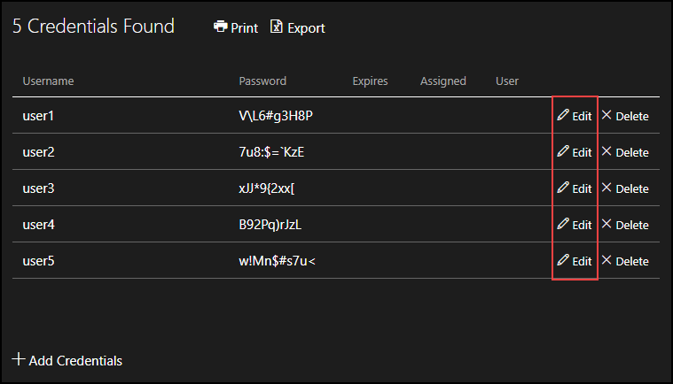

# Cloud Credential Pool 

Cloud Credential Pools allow you to upload credentials and then distribute sets of credentials to lab users, in the lab instructions. These credentials can be to log in to a cloud platform, a website, or any other platform that your lab uses. Credential pools are not used to provide credentials to virtual machines (VM). VM credentials are provided in lab instructions, based on the credentials configured in the VM profile. 

## Table of Contents 

- [Edit View](#edit-view)
    - [Basic Information](#basic-information)
    - [Credentials Properties](#credentials-properties)
- [Details View](#details-view)
    - [Add Credentials](#add-credentials)
    - [Move Credentials](#move-credentials)

## Edit View

These options are only displayed while editing a Cloud Credential Pool. 

To edit a Credential Pool, select the **Edit** button in the upper-right corner of the page.

### Basic Information  

1. **Name**: The name of the pool, as shown in Lab on Demand administration pages. 
1. **Display Name**: The display name will be shown in the lab instructions, to lab users.
1. **Description**: A description of the credentials in the pool. 
1. **Organization**: Select the organization with access to manage the pool.
1. **Desired Depth**: Enter the desired number of credentials to be available in the pool.
1. **Reuse Policy**: Select a policy for how credentials will be reused. 
    - **Always issue new credentials**: each lab launch will be given a new set of credentials. 
    - **Reuse credentials for a given user within a class and/or event**: when a user launches any lab in a class or event, they will receive the same credentials. 
    - **Reuse credentials for a given user for the same lab profile**: when a user relaunches the same lab profile, they will receive the same credentials. 
    - **Reuse credentials for a given user for the same lab series**: when a user relaunches a lab profile from the same lab series, they will receive the same credentials. 
    - **Always reuse credentials for a given user**: when a user launches any lab profile from any lab series, they will receive the same credentials.
1. **Enabled**: Select to enable the credential pool for use.
1. **Demo Mode**: Select to enable Demo Mode. Demo Mode displays the word _Demo_ for each credential property configured in the pool, instead of displaying credentials configured in the pool. This is useful to demonstrate how a credential pool works and displays credentials, without using valid credentials. 
    1. **Demo mode expires**: Select this to choose a date and time for Demo Mode to be disabled on the pool, and start issuing valid credentials configured in the pool. 
1. **Issue to instructor-led (ILT) launches**: Select to issue credentials to the assigned instructor of instructor-led launches.
1. **Issue to non-ILT launches**: Select to issue credentials to non-instructor-led launches.
1. **Enable low availability notifications**: Select to enable a notification to be sent when the number of available credentials falls below the specified threshold. 
    1. **Low availability notification threshold**: The number of credentials remaining in the pool to trigger a notification. 
    1. **Low availability notification expiration threshold**: If credentials expiring before this threshold will cause the number of Available credentials to drop below the "Low availability notification threshold", then a notification will be sent.
    1. **Low availability notification email**: The email address that low availability notifications will be sent to.
1. **Block lab launches when no credentials are available**: Select this to prevent any lab profile from launching that has this credential pool attached, when there are no credentials available for use in the pool. 
1. **Custom credentials unavailable message**: Enter a message that will be displayed in the lab instructions, if there are no credentials available for use. 

### Credentials Properties 

By default, credential pools have a Username property and a Password property. The default properties can be changed, or additional properties can be added.

1. Select **Add Credential Property** to add a credential property. 

1. Enter a label for the credential property. This label will be displayed when adding credentials to the pool. 

## Details View 

These options below are only displayed while editing a Cloud Credential Pool. 

If you are editing the Credential Pool, select the **Details** button in the upper-right corner to display the Details view. 

### Add Credentials 

Credentials can be added from the details page of the credential pool. The properties available for each credential you add is dependent on the credential properties that are configured on the pool. 

1. Scroll to the bottom of the page and select **+ Add Credential**. 
1. Enter credentials with properties separated by commas, one set per line. For example, Username1,Password1.

    >[!Knowledge] To add additional credential properties, select **Edit** on the pool, and then go to the Credential Properties tab, and enter any credential properties that are needed. 

### Move Credentials 

Credentials can be moved from a Credential Pool, to another Credential Pool in Lab on Demand. 

1. Select **Move Credentials** at the top of the page. 

    

1. Select the **Destination Pool**. 
1. Select the **Credentials** that will be moved. 

### Edit Credentials 

After credentials are added to a pool, they can be edited invididually if needed. Each credential property can be edited, and optionally an expiration date can be added. Additional credential properties can be added by editing the pool and selecting the Credential Properties tab. 

1. Click **Edit** next to the credential that you wish to edit. 
1. After changes are made to the credential, select **OK**.  

    