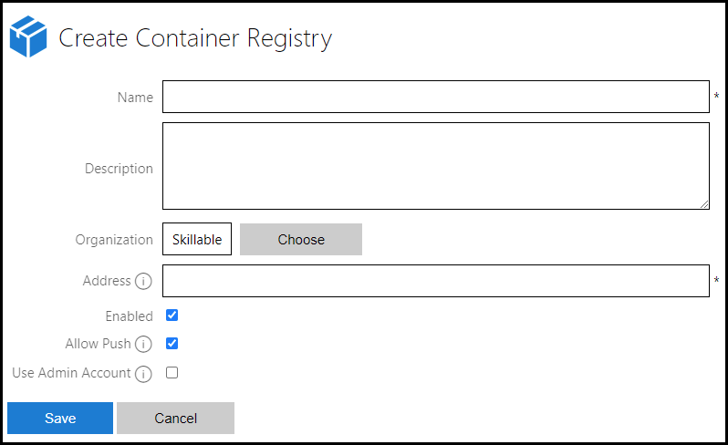

# Container Registries

Skillable Studio supports creating custom container registries that are linked to an external registry, such as a Docker Hub repository. 

When persisting changes to a container image, you can choose to save the changes to the custom container registry. This allows you to use containers defined in any registry you have access to in your labs.

## Create a Container Registry

1. From the Skillable Studio Admin page, click **Container Registries**.

1. Click **Create Container Registry** in the upper-right corner of the page. 

1. Populate the following fields:

    

    - **Name**: Enter the name of the container registry. This will be the display  name in Skillable Studio. 

    - **Description**: Enter a description for the container registry. 

    - **Organization**: Select the organization that the container registry will be     available to. 

    - **Address**: Enter the full address of the registry, e.g. registry.hub.docker.com.
    - **Enabled**: Check this box to enable the container registry for use. 

    - **Allow Push**: Check this box to allow container changes to be pushed to the    container registry. If this is not enabled, container changes cannot be persisted   from a running lab to this container registry. 

    - **Use Admin Account**: 
    
        - **When enabled**, a single administrator account username/ password will be use to pull, push, and update container images belonging to this repository. 
        - **When disabled**, individual registry user accounts will be used instead.

## Container Registry Accounts

When you are persisting changes in a container lab, you can persist changes to a specific container registry account, by configuring an account in your container registry. You may add any number of external registry accounts to your container registry in Skillable Studio. This is useful if you have containers in a registry such as Docker Hub, and have multiple organizational accounts for managing your container images.

>[!knowledge] **Single administrator accounts should only be used for non-standard registry implementations** like Azure Container Registries. For Docker Hub and other standard implementations, you should not use this option.

### Add Container Registry Accounts

1. From container registry details page, click **Add Account**

1. Enter the **username** used to log in to the registry account. 

1. Enter the **password** used to log in to the registry account. 

1. Select the organization that registry account will be available to. Any users that belong to the chosen organization will be able to push, pull and update container images to this registry account. 

After accounts are configured, there will be an option to select a registry account to push the changes to, when you are persisting changes in a lab.

## Related Topics 

- [Container Images](container-images.md)

- [Container Volumes](container-volumes.md)

- [Container Web Display](container-web-display.md)

