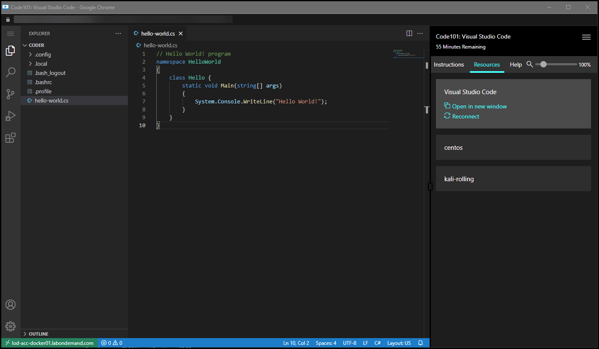
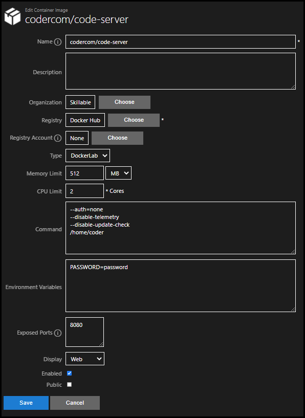

# Container Web Display 

In Skillable Studio, containers can be configured to expose specific ports. Each exposed port will be dynamically mapped to an external port on the lab host server when the lab is deployed. Skillable uses a proxy to secure the web application, and adds an SSL certificate, to prevent unauthorized users from accessing your content.  

Selecting the Web Display option for the exposed port will allow the container to output through the exposed port and display in a web browser. 

>[!note] Web display of exposed container ports may not work with all container images. The author of the container image must enable port output support in the container image for this to work correctly. 

- [Configuring a Container Profile for Web Display](#configuring-a-container-profile-for-web-display)
    - [Container Configuration](#container-configuration)
    - [Lab Profile Configuration](#lab-profile-configuration)
- [Example Configuration](#example-configuration)
- [Related Information](#related-information)

## Configuring a Container Profile for Web Display 

### Container Configuration 

1. **Navigate to the container** you wish to output the display, or create a new container. 

1. Select **Edit** on the container profile. 

1. (Optional) Enter an **Entry Point** if needed. An Entry Point allows you to set or override the container's default entry point. `Example: /bin/bash` 

1. Enter any **Commands** that the container will need. Commands may be needed for your container to perform a specific way, or output on an exposed port. Consult the documentation for the author or publisher of your container image for more information. 

1. Enter any **Environment Variables** that the container will need. 

1. Enter the port to expose and output the container display to. The port entered should be the port that the container author suggests using for display output. 

1. (Optional) Enter a **Start Path** if needed. A Start Path allows signing in to the web application in the container, using a URL parameter. `Example: app/login`

1. Select **Web** on the **Display** option. 

1. Decide if the container should use relative links or absolute links. These links determine how the container's web application generates links to pages within the web application. Enable this option to use relative links within the container. Disabling will cause the container to use absolute links. 

1. **Save** the container profile. 

### Lab Profile Configuration 

1. **Navigate to the Lab Profile** you wish to use the container image with. 

1. On the **Networks** tab, select **Add Network** to add a network. Web display requires a network on the lab profile. 

1. On the **Containers** tab, select **Add Container Image**. 

    1. **Search** for the name of **your container**. 
    1. **Select** your **container**. 
    1. Select **OK**. 

1. Select **Save** to save your lab profile. 

Your lab should now be configured to display the output of the container to a web browser.

## Example Configuration

This example configuration uses the [Visual Studio Code in the browser](https://hub.docker.com/r/codercom/code-server) to output Visual Studio Code to port 8080 and display in a web browser.

{1000}

1. **Create** a new **container profile**. 

1. In the **Name** field, enter `codercom/code-server`.

1. Select the **Registry** that the container image will use. If you do not have a container registry, choose **Docker Hub**.

1. In the **Commands** field, enter the following commands. Each command should be on a separate line. 

    - `--auth=none`
    - `--disable-telemetry`
    - `--disable-update-check`
    - `/home/coder`

1. Enter the following environmental variables. If there were multiple environment variables, they would need to each be on a separate line. 

    - `PASSWORD=password`

1. Enter the following exposed port: 

    - `8080`

1. Select **Web** on the **Display** option. 

1. Verify your container matches the image below and then select **Save** to save the container image. 

{600}

## Related Information 

- [Containers Images](container-images.md)

- [Container Registries](container-registries.md)

- [Container Volumes](container-volumes.md)

